```nix
{ pkgs, lib, ... }:

{
  victor = {
    name     = "Victor Ferreira";
    handle   = "v1cferr";
    role     = "AI Systems Analyst";
    at       = "FAI·UFSCar";
    location = "São Carlos, SP, Brazil";
  };

  environment.systemPackages = with pkgs; [ python313 typescript nix gleam ];

  stack = {
    backend  = [ "FastAPI" "SQLAlchemy 2.0 (async)" "Alembic" "PostgreSQL" ];
    frontend = [ "Next.js (App Router)" "React" "Tailwind" ];
    ai       = [ "RAG" "Ollama" "MCP" ];
    infra    = [ "NixOS" "Docker Compose" "Caddy" "Playwright" "Azure (Bicep)" ];
  };

  networking.hostName = "nixos-kingston";

  hardware = {
    cpu  = "Intel i5-11400";
    gpu  = "Intel Arc B580";                    # open xe driver, Mesa, no CUDA
    disk = "Kingston KC3000, btrfs subvolumes";
    boot = "GRUB, dualboot, Secure Boot signed with my own keys";
  };

  programs.llm = {
    enable   = true;
    provider = "ollama";
    local    = true;         # nothing leaves the machine
    trust    = "proposals";  # a model is never the source of a fact
  };

  meta = {
    homepage = "https://v1cferr.dev";
    setup    = "https://v1cferr.dev/en-us/setup";
    linkedin = "https://linkedin.com/in/v1cferr";
    email    = "dev.victorferreira@gmail.com";
  };
}
```

[v1cferr.dev](https://v1cferr.dev) · [setup](https://v1cferr.dev/en-us/setup) · [LinkedIn](https://www.linkedin.com/in/v1cferr/) · [dev.victorferreira@gmail.com](mailto:dev.victorferreira@gmail.com)

<!--
A language/stats card can go here, e.g.:
https://github-readme-stats.vercel.app/api/top-langs/?username=v1cferr&layout=compact&langs_count=8&hide=html,css,tex&hide_border=true
Left out on purpose: the public instance is frequently rate-limited and renders as a
broken image, which reads worse than no card at all. Self-host it if you want it back.
-->
